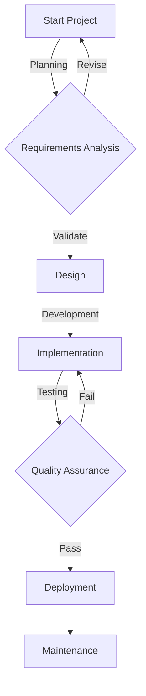
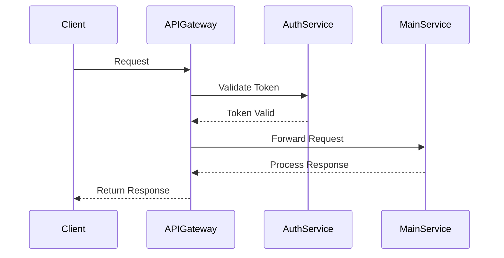
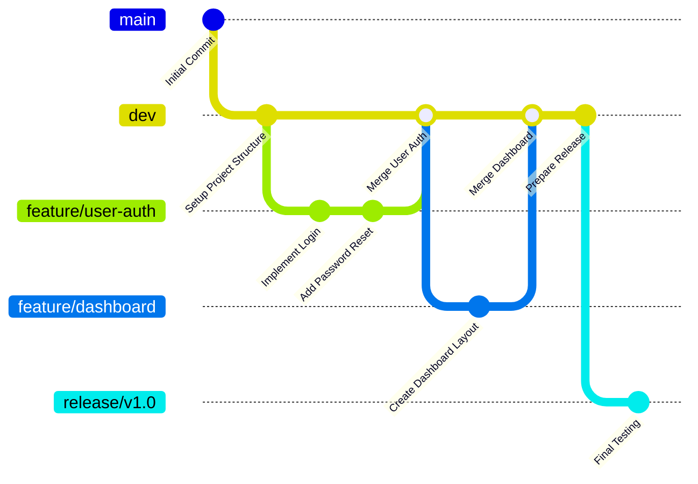
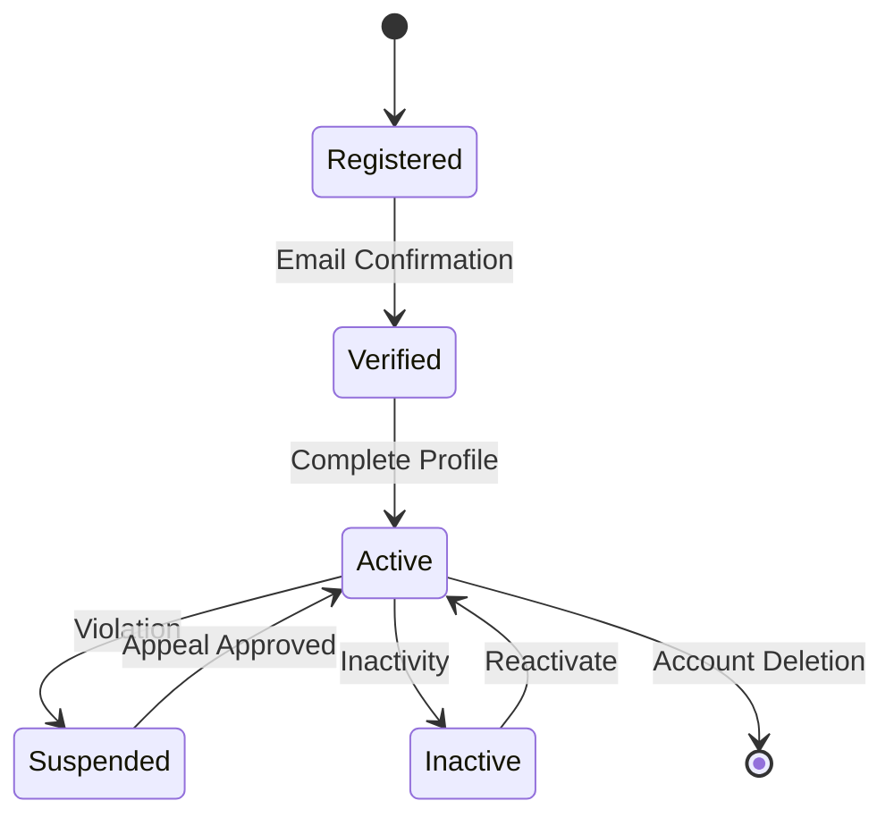
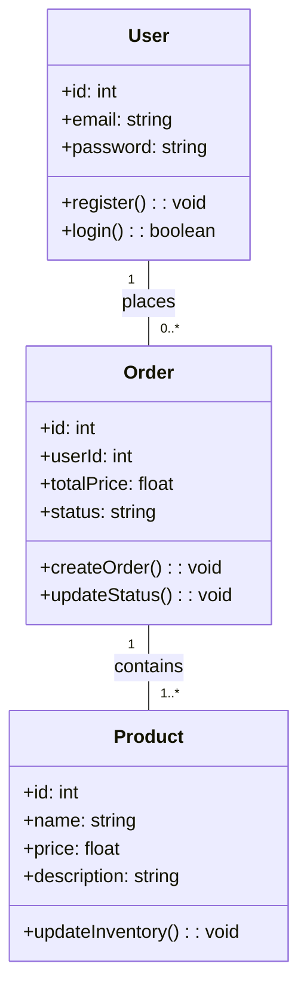
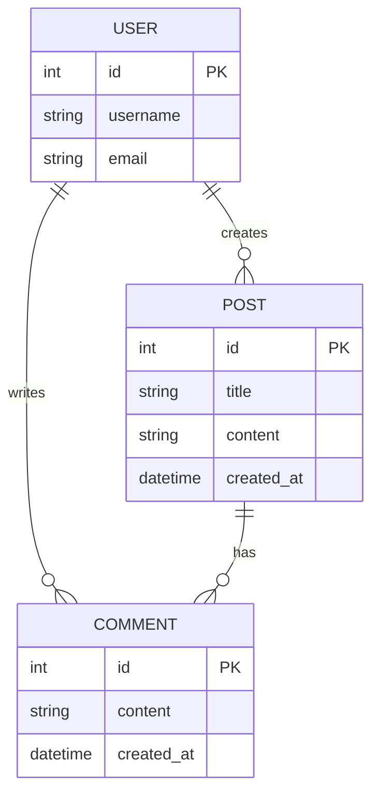
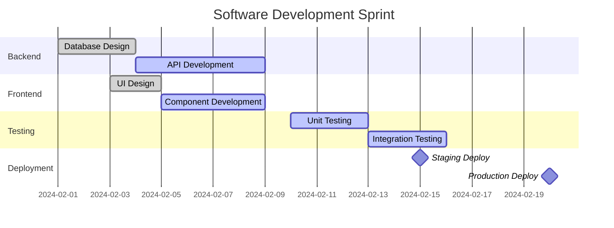

# Mermaid Diagram Examples for Developers

## 1. Flowchart: Project Workflow


## 2. Sequence Diagram: API Interaction


## 3. Git Workflow Diagram


## 4. State Diagram: User Account Lifecycle


## 5. Class Diagram: E-commerce System


## 6. Entity Relationship Diagram: Blog Platform


## 7. Gantt Chart: Sprint Planning


## Tips for Using Mermaid
1. Install Mermaid library in your documentation tools
2. Use in markdown files, documentation platforms
3. Can be integrated with tools like GitHub, VS Code
4. Great for visualizing complex systems and workflows
```

