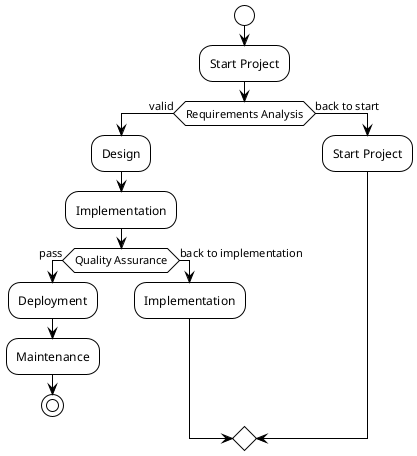
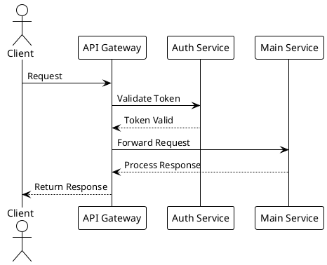
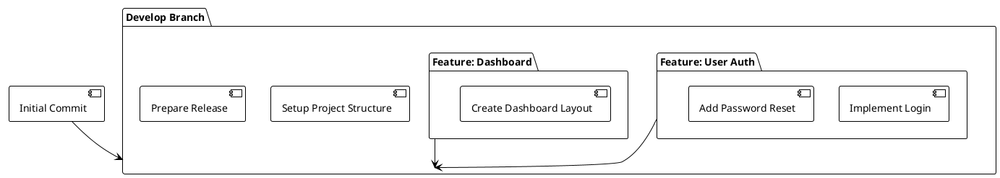
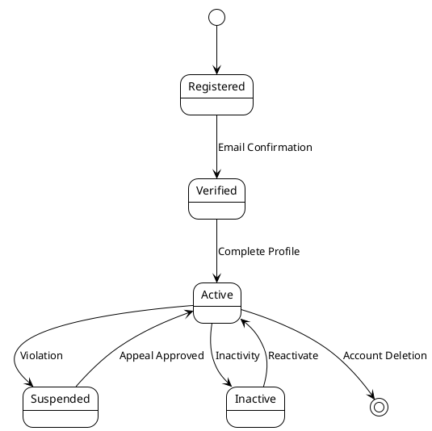
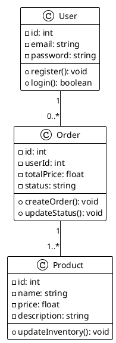
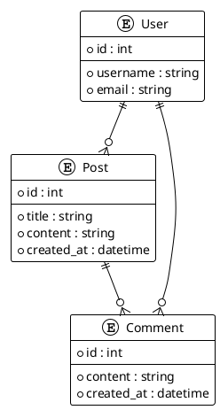
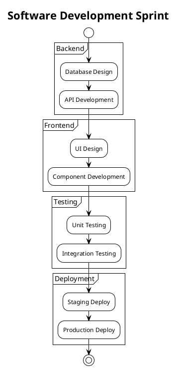

# PlantUML Diagram Examples for Developers

## 1. Flowchart: Project Workflow


## 2. Sequence Diagram: API Interaction


## 3. Component Diagram: Git Workflow


## 4. State Diagram: User Account Lifecycle


## 5. Class Diagram: E-commerce System


## 6. Entity Relationship Diagram: Blog Platform


## 7. Activity Diagram: Sprint Planning


## Tips for Using PlantUML
1. Requires PlantUML processor or plugin
2. Works with many text editors and documentation tools
3. Can be integrated with Markdown, AsciiDoc
4. Supports multiple diagram types
5. Version control friendly due to text-based format
```